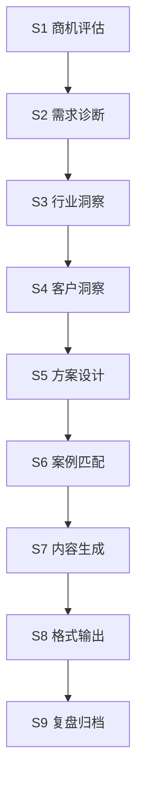

# 解决方案专家 Agent 控制台 - 产品需求文档

## 1. 产品概述

解决方案专家 Agent 控制台是一个面向售前团队的信息展示平台，通过块状卡片形式展示提案生成全流程的关键信息。帮助售前团队快速了解当前项目状态、知识库概览、品牌案例和输出成果。

**核心价值：**
- 可视化呈现 9 阶段提案生成流程（S1-S9）
- 集中展示知识库 9 大知识集合
- 快速查阅 16 个服务品牌和成功案例
- 实时追踪提案各阶段状态

---

## 2. 核心功能

### 2.1 用户角色
| 角色 | 说明 | 核心权限 |
|------|------|----------|
| 售前顾问 | 使用 Agent 生成提案 | 查看流程、使用知识库、生成提案 |
| 方案专家 | 设计和审核方案 | 流程管理、方案审核 |
| 管理员 | 管理系统配置 | 全部权限 |

### 2.2 功能模块

1. **流程总览页**：展示 S1-S9 完整流程，当前阶段高亮，已完成/未完成状态清晰
2. **阶段详情卡**：展示当前选中阶段的详细信息、输入输出
3. **知识库概览**：展示 9 大知识集合的条目数和内容摘要
4. **品牌案例卡**：展示 16 个服务品牌和成功案例标签
5. **行业覆盖卡**：展示 10 个覆盖行业及核心打法
6. **产品能力卡**：展示 6 大产品线的成熟度和核心能力
7. **输出成果卡**：展示提案输出格式（飞书 Slides/Docx/PPTX）

---

## 3. 核心流程

### 3.1 提案生成流程（S1-S9）



### 3.2 用户交互流程

用户进入首页 → 查看流程总览 → 选择当前阶段 → 查看阶段详情 → 浏览知识库/品牌/案例 → 追踪输出成果

---

## 4. 用户界面设计

### 4.1 设计风格

- **风格定位**：专业商务风格，简洁现代，数据驱动
- **主色调**：#1a1a2e 深蓝黑 + #e94560 玫红点缀
- **辅助色**：#16213e 深蓝、#0f3460 中蓝、#f1f1f1 浅灰白
- **字体**：标题使用 Noto Sans SC Bold，正文使用 Noto Sans SC Regular
- **布局**：卡片式块状布局，网格响应式
- **图标**：Lucide Icons，线性风格

### 4.2 页面结构

| 模块 | 说明 | 布局位置 |
|------|------|----------|
| 顶部导航 | Logo + 标题 + 用户信息 | 固定顶部 |
| 流程总览 | S1-S9 阶段横向展示 | 页面顶部 |
| 阶段详情 | 当前选中阶段详细信息 | 左侧大卡片 |
| 知识库概览 | 9 大知识集合卡片网格 | 右侧区域 |
| 品牌案例 | 16 品牌 + 案例标签 | 底部区域 |
| 产品能力 | 6 大产品卡片 | 底部区域 |
| 输出成果 | 3 种格式输出状态 | 右下角固定 |

### 4.3 响应式策略

- **桌面优先**（1200px+）：完整 3 列布局
- **平板适配**（768px-1199px）：2 列布局，卡片堆叠
- **移动端**（<768px）：单列垂直布局

### 4.4 动画效果

- 卡片悬停：轻微上浮 + 阴影加深，200ms ease-out
- 阶段切换：淡入淡出，300ms
- 页面加载：卡片依次淡入，stagger 50ms

---

## 5. 数据结构

### 5.1 流程阶段数据

```typescript
interface Stage {
  id: string;          // S1-S9
  name: string;        // 阶段名称
  description: string; // 阶段描述
  status: 'pending' | 'in_progress' | 'completed';
  inputs: string[];    // 输入
  outputs: string[];   // 输出
  icon: string;        // 图标名称
}
```

### 5.2 知识集合数据

```typescript
interface KnowledgeCollection {
  id: string;
  name: string;
  description: string;
  count: number;
  source: string;
}
```

### 5.3 品牌数据

```typescript
interface Brand {
  id: string;
  name: string;
  industry: string;
  logo: string;
}
```
