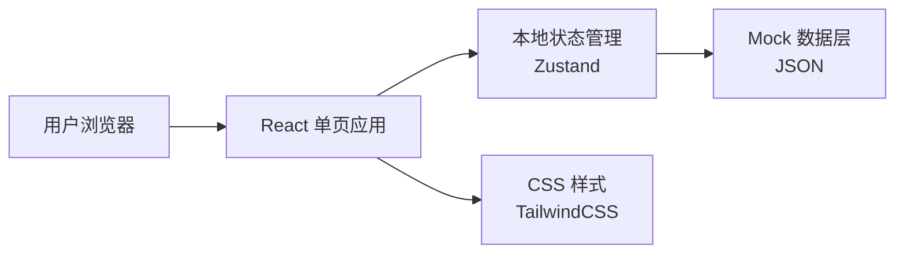

# 解决方案专家 Agent 控制台 - 技术架构文档

## 1. 架构设计



**说明：**
- 前端单页应用，无需后端服务
- 使用 Mock 数据展示信息
- 响应式布局适配多端

---

## 2. 技术选型

| 类别 | 技术 | 版本 |
|------|------|------|
| 框架 | React | 18.x |
| 构建工具 | Vite | 5.x |
| 语言 | TypeScript | 5.x |
| 样式 | Tailwind CSS | 3.x |
| 图标 | Lucide React | 最新 |
| 字体 | Google Fonts (Noto Sans SC) | - |
| 动画 | CSS Transitions + Framer Motion | - |

---

## 3. 路由定义

| 路由 | 用途 |
|------|------|
| / | 首页 - 完整控制台视图 |

---

## 4. 页面结构

```
App
├── Header (顶部导航栏)
├── MainContent
│   ├── FlowOverview (S1-S9 流程总览)
│   ├── ContentGrid
│   │   ├── StageDetail (阶段详情)
│   │   ├── KnowledgeSection (知识库概览)
│   │   ├── BrandsSection (品牌案例)
│   │   ├── IndustriesSection (行业覆盖)
│   │   ├── ProductsSection (产品能力)
│   │   └── OutputSection (输出成果)
```

---

## 5. 组件清单

| 组件 | 说明 |
|------|------|
| Header | 顶部导航，包含 Logo 和标题 |
| FlowOverview | S1-S9 阶段横向流程展示条 |
| StageCard | 单个阶段卡片 |
| StageDetail | 选中阶段的详细信息面板 |
| KnowledgeCard | 知识集合卡片 |
| BrandCard | 品牌展示卡片 |
| IndustryCard | 行业展示卡片 |
| ProductCard | 产品能力卡片 |
| OutputCard | 输出成果卡片 |
| GridLayout | 响应式网格布局容器 |

---

## 6. Mock 数据结构

```typescript
// 9个流程阶段
const stages = [
  { id: 'S1', name: '商机评估', status: 'completed', ... },
  { id: 'S2', name: '需求诊断', status: 'in_progress', ... },
  // ...
];

// 9大知识集合
const knowledgeCollections = [
  { id: 'methodology', name: '核心方法论', count: 6, ... },
  // ...
];

// 16个品牌
const brands = [
  { id: 'feihe', name: '飞鹤', industry: '母婴', ... },
  // ...
];

// 10个行业
const industries = [
  { id: 'mother_baby', name: '母婴', ... },
  // ...
];

// 6个产品
const products = [
  { id: 'kos', name: 'KOS代发代管', maturity: '成熟', ... },
  // ...
];
```

---

## 7. 文件结构

```
services/web-chat/src/
├── App.tsx              # 主应用
├── App.css              # 全局样式
├── main.tsx             # 入口文件
├── components/
│   ├── Header.tsx
│   ├── FlowOverview.tsx
│   ├── StageDetail.tsx
│   ├── KnowledgeSection.tsx
│   ├── BrandsSection.tsx
│   ├── IndustriesSection.tsx
│   ├── ProductsSection.tsx
│   └── OutputSection.tsx
├── data/
│   └── mockData.ts      # Mock 数据
└── index.css            # Tailwind 入口
```

---

## 8. 样式规范

- 使用 Tailwind CSS 原子化类名
- CSS 变量定义主题色
- 卡片统一圆角 `rounded-xl`
- 阴影统一 `shadow-lg hover:shadow-xl`
- 过渡动画 `transition-all duration-200`
