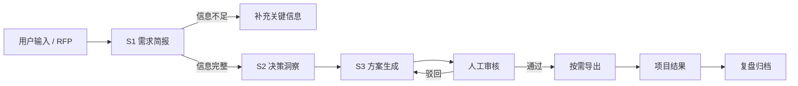

# 解决方案专家 Agent

面向易美传播与弘摩科技售前团队的小红书营销提案生成系统。项目把分散的行业知识、客户案例、产品能力和商务方法论组织为可执行工作流，用于快速形成结构一致、证据可追溯、可人工审核的售前方案。

当前版本：**8.0（简化工作流）**

## 核心定位

项目将小红书视为消费决策平台，而不是单一搜索平台。方案从用户决策问题出发，统一考虑：

> 内容激发需求 × 搜索承接意图 × 多角色构建信任 × 多载体完成转化 × 数据反馈持续优化

Feed 信息流负责创造兴趣和需求，Search 搜索流负责承接主动意图、比较验证与长期内容沉淀。KOL、KOC、KOS、品牌号、SEO、评论区、付费投放、CID、POI 和线下承接等手段，按用户所处的决策阶段组合使用。

## 简化后的工作流

原有 9 个串行 Skill 已收敛为 3 个业务级核心 Skill。研究、案例检索、格式输出和归档回到工具或生命周期事件，减少重复理解、重复生成和状态分叉。



| 类型 | 能力 | 职责 |
|---|---|---|
| Core Skill | 需求简报 | 提取客户、行业、问题、目标、预算、竞品和时间线，识别信息缺口并选择研究模式 |
| Core Skill | 决策洞察 | 整合行业、搜索意图、竞品、客户现状和知识库证据，形成用户决策地图 |
| Core Skill | 方案生成 | 生成唯一 `proposal_spec`，统一承载策略、案例、预算、实施路径和页面内容 |
| Tool | 研究采集 | 在完整研究模式下采集小红书行业与竞品信息 |
| Tool | 案例检索 | 按行业、项目类型、痛点和方案模块匹配历史案例 |
| Tool | 格式输出 | 人工审核通过后，按需生成 Slides、Docx 或 PPTX |
| Lifecycle | 复盘归档 | 项目结束且取得真实结果后，更新案例、竞品和复盘知识 |

主流程只维护一份方案事实源 `proposal_spec`。审核前不生成对外文件，没有真实审核意见和项目结果时不写入复盘知识库。

## 系统组成

- **编排服务**：FastAPI + LangGraph，负责 3-Skill 工作流、审核、输出和归档接口。
- **Web 界面**：React + TypeScript + Vite，展示工作流、能力体系与提案交互界面。
- **知识与数据**：PostgreSQL/pgvector、Qdrant、Redis，承载原始数据、结构化知识和会话记忆。
- **模型层**：默认支持本地 Ollama，也可通过环境变量配置云端模型。
- **任务执行**：Celery Worker 与调度器处理异步任务和周期性工作。

## 项目结构

```text
.
├── services/
│   ├── orchestrator/          # API、工作流、核心 Skills 与工具
│   ├── web-chat/              # React 前端
│   ├── feishu-bot/            # 飞书机器人服务
│   └── nginx/                 # 统一入口配置
├── skills/                    # 旧版 S1-S9 兼容实现
├── Database/                  # 三层数据架构的导入与样例数据
├── scripts/                   # 知识库构建及数据导入脚本
├── tests/                     # 简化工作流与数据层测试
├── docs/superpowers/specs/    # 架构设计基线
├── SOUL.md                    # Agent 身份、方法论与行为准则
└── docker-compose.yml         # 本地全栈编排
```

## 快速启动

### 环境要求

- Docker Desktop 与 Docker Compose
- 如需本地模型：支持 Ollama 的运行环境；GPU 模式需要 NVIDIA 容器运行支持
- 如需单独开发前端：Node.js 20+

### 1. 配置环境变量

PowerShell：

```powershell
Copy-Item .env.example .env
```

按实际环境填写飞书、数据库和模型配置。不要将真实密钥提交到仓库。

### 2. 启动服务

```powershell
docker compose up -d
```

启用 GPU Ollama：

```powershell
docker compose --profile gpu up -d
docker compose exec ollama ollama pull qwen2.5:7b
```

默认入口：

- Web：<http://localhost:3000>
- API：<http://localhost:8000>
- 健康检查：<http://localhost:8000/health>
- Qdrant：<http://localhost:6333>

### 3. 初始化知识库

```powershell
docker compose exec orchestrator python scripts/init_knowledge_base.py
```

## 提案 API

### 生成审核稿

```http
POST /api/proposal/generate
Content-Type: application/json

{
  "user_input": "为某母婴品牌制定小红书新品上市方案，预算 100 万，计划 9 月上线",
  "research_mode": "auto",
  "output_formats": ["pptx"]
}
```

返回状态：

- `awaiting_input`：关键信息不足，需要补充；
- `awaiting_review`：已生成审核稿，等待人工审核。

### 审核并输出

```http
POST /api/proposal/{request_id}/review
Content-Type: application/json

{
  "approved": true,
  "comments": "审核通过",
  "output_formats": ["pptx"]
}
```

审核驳回时进入修改状态；审核通过后才调用输出工具。

### 项目归档

```http
POST /api/proposal/{request_id}/archive
Content-Type: application/json

{
  "bid_result": "中标，进入执行阶段",
  "review_comments": "搜索承接策略获得客户认可"
}
```

归档要求方案已经审核通过，并提供真实项目或竞标结果。

## 验证

后端测试：

```powershell
docker compose exec orchestrator pytest -v
```

前端构建：

```powershell
Set-Location services/web-chat
npm install
npm run build
```

当前简化工作流已覆盖：信息缺口拦截、快速/完整研究模式、单一 `proposal_spec`、审核前禁止导出、项目结果缺失时禁止归档等关键约束。

## 当前状态与限制

- 3-Skill 主工作流、审核接口、按需输出工具和前端展示已完成。
- 根目录 `skills/s1_*.py` 至 `skills/s9_*.py` 暂时保留，作为兼容实现；新主流程不再串行调用它们。
- 提案运行状态当前保存在进程内存中，服务重启后不会保留。
- `services/orchestrator/app/db/database.py` 仍是数据库持久化占位实现，因此复盘归档会明确返回失败，直至持久化层完成。
- Docker 运行结果取决于本机容器、模型和外部服务配置；首次启动前请核对 `.env`。

## 进一步阅读

- [Agent 灵魂文档](SOUL.md)
- [简化工作流设计](docs/superpowers/specs/2026-07-15-simplified-proposal-workflow.md)
- [三层数据架构设计](docs/superpowers/specs/2026-06-18-three-layer-data-architecture-design.md)

## 使用边界

本项目用于内部售前方案生产与知识复用。任何对外文件都应经过人工审核，并确认使用“易美传播”或“弘摩科技”对应版本。标记为“只展示不外发”或 WIP 的材料不得直接对外发布。
